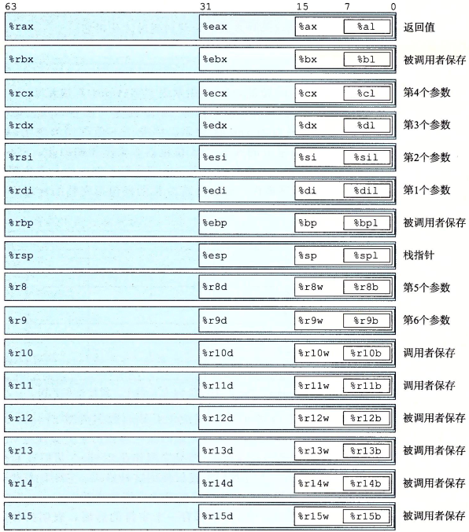
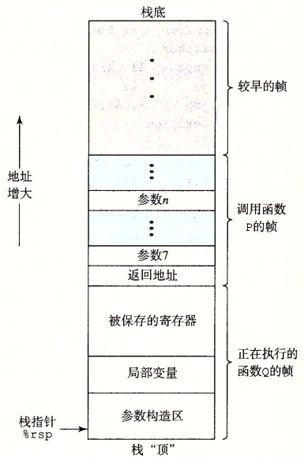
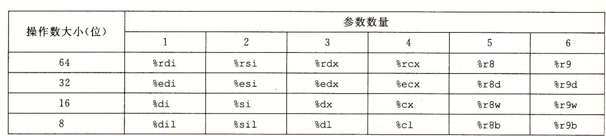
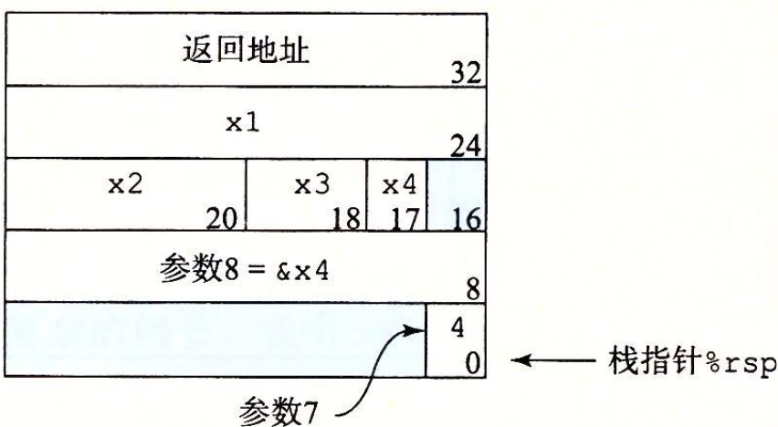
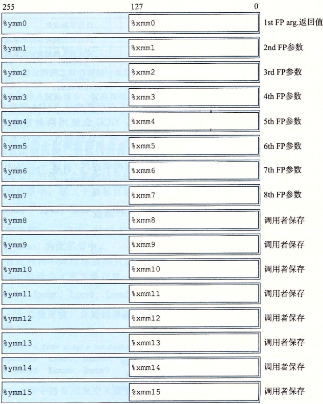

1.  x86-64 寄存器     
    + 程序计数器，通常成为 PC，给出 ___给出将要执行的下一条指令___ 的内存地址      
    + 整数寄存器文件，包含16个命名的位置，分别存储64位的值，可以存储：      
      + 存储地址      
      + 整数数据      
      + 记录某些重要的程序状态    
      + 保存临时数据，例如过程的参数，局部变量，或者返回值    
      + 条件码寄存器，保存最近执行的算数或者逻辑指令的状态信息，它们用来实现控制或者数据流中的条件，比如说实现 `if`，`while` 语句   
      + 一组向量寄存器可以存放一个或者多个整数或者浮点数值      
2.  x86-64 机器指令     
    1.  x86-64 的指令长度从1-15个字节不等     
    2.  指令格式：从某个给定位置开始，将字节唯一地解码成机器指令      
    3.  反汇编基于机器代码文件中的字节序列确定汇编代码，它不需要访问该程序的源代码或者汇编代码      
    4.  反汇编器使用的指令明明规则与 GCC 产生的汇编代码使用有些细微的差别。它省略了很多指令结尾的 'q' ，这些后缀时大小指示符。在大多数情况下都可以省略     
3.  所有以 '.' 开头的行都是指导汇编器和连接器工作的伪指令   
4.  后缀表示的字节数：      
    |后缀|字节数|
    |-|-|
    |b|1|
    |w|2|
    |l|4|
    |q|8|

5.       
    + 16个寄存器的低位部分都可以作为字节，字，双字，四字来访问      
    + 访问小于8字节结果的指令时，有两种规则：    
      + 生成1字节和2字节数字的指令会保持剩下的字节不变      
      + 生成4字节数字的指令会把高位4字节置为0，这条规则时从 IA32 到x86-64 的扩展的一部分采用的      
6.  操作数，大多数指令有一个或者多个操作数，它用来指示出执行一个操作中要使用的源数据值，以及放置结果的目的位置    
    + 源操作数可以以常数给出，或者从寄存器，内存中读出。结果可以存放在寄存器或者内存中，因此操作数可能性可以被分为三种类型：      
      + 立即数，表示常数值。不同指令允许的立即数数值范围不同，汇编器会自动选择最近凑的方式进行数值编码      
      + 寄存器，它表示某个寄存器的内容，16个寄存器的低位。用 r<sub>a</sub> 表示寄存器a，用 R[r<sub>a</sub>] 表示它的值    
      + 内存引用，会根据计算出来的地址访问某个内存的位置。用符号 M<sub>a</sub>[Addr] 表示对存储在内存中从地址 Addr 开始的 b 个字节的引用。   
7.  练习题3-1： 9(%rax, %rax) = M[R[rax] + R[rax] + 9]      
8.  简单的数据传送指令    

    |指令|效果|描述|
    |-|-|-|
    |MOV S, D|D &larr; S|传送| 
    |movb||传送字节|
    |movw||传送字|
    |movl||传送双字|
    |movq||传送四字|
    |movabsq I, R|R &larr; I|传送绝对的四字|
    + 源操作数可以存储在内存或者寄存器中；目的操作数指定一个位置，要么在内存中，或者在寄存器中。但两者不能同时都 ___指向内存位置___         
    + mov 指令只会更新目的操作数指定的那些寄存器字节或者内存位置。唯一例外的是，mvol 指令以寄存器作为目的时。他会将该寄存器的高位4字节设置为0。原因是 x86-64 采用惯例，即任何为寄存器生成32位值的指令都会把该寄存器的高位部分置为0        
    + 五种组合      
        ```
      movl $0x4050, %eax         立即数 -> 寄存器，4 bytes
      movw %bp, %sp              立即数 -> 寄存器，2 bytes
      movb (%rdi, %rcx), %al     内存 -> 寄存器，1 bytes
      movb $-17, (%rsp)          立即数 -> 内存，1 bytes
      movq %rax, -12(%rbp)       寄存器 -> 内存，8 bytes
        ```
      上述的 `movq` 指令只能以表示为32为补码数字的立即数作为源操作数，然后把这个值符号扩展到64位的值，放到目的位置。`movabsq` 指令能够以任意64位立即数值作为源操作数，并且只能以寄存器作为目的     
9.  `movz` 类中的指令把目的中剩余的字节填充为0。每条指令名字的最后两个字符都是大小指示符，第一个字符指定源的大小，第二个指定目的的大小     
    |指令|效果|描述|
    |-|-|-|
    |movz S, R| R &larr; 零扩展(S)|以零扩展进行传送|
    |movzbw||将做了零扩展的字节传送到字|
    |movzbl||将做了零扩展的字节传送到双字|
    |movzwl||将做了了零扩展的字传送到双字|
    |movzbq||将做了零扩展的字节传送到四字|
    |movzwq||将做了零扩展的字传送到四字|

10. `movs` 类中的指令通过符号扩展来填充，把源操作的最高位进行复制。每条指令名字的最后两个字符都是大小指示符，第一个字符指定源的大小，第二个指明目的的大小       
    |指令|效果|描述|
    |-|-|-|
    |movs S, R|R &larr; 符号扩展(S)|传送符号扩展的字节|
    |movsbw||将做了符号扩展的字节传送到字|
    |movsbl||将做了符号扩展的字节传送到双字|
    |movswl||将做了符号扩展的字传送到双字|
    |movsbq||将做了符号扩展的字节传送到四字|
    |movswq||将做了符号扩展的字传送到四字|
    |movslq||将做了符号扩展的双字传送到四字|
    |cltq|%rax &larr; 符号扩展(%eax)|把%eax符号扩展到%rax|

11. 练习题3-3     
    ```
    movb $0xF, (%ebx)               can not use %ebx as address register
    movl %rax, (%rsp)               mismatch between instruction suffix and register ID
    movw (%rax), 4(%rsp)            can not have both source and destination be memory references
    movb %al, %sl                   no register named %sl
    movq %rax, $0x123               can not have immedinate as distination
    movl %eax, %rdx                 destination operand incorrect size
    movb %si, 8(%rbp)               mismatch between instruction suffix and register ID
    ```
12. 练习题3-4，假设：     
    ```
    src_t *sp;
    dest_t *dp;
    ```
    要实现 `*dp = (dest_t)*sp;`以下变换：     
    ___当执行强制类型转换既设计大小变换又涉及 C语言 中符号变化时，操作应该先改变大小___     

    |src_t|dest_t|指令|
    |-|-|-|
    |long|long|movq (%rdi), %rax<br>movq %rax, (%rsi)|
    |char|int|movsbl (%rdi), %eax<br>movl %eax, (%rsi)|
    |char|unsigned|movsbl (%rdi), %eax<br>movl %eax, (%rsi)|
    |unsigned char|long|movzbl %(rdi), %eax<br>movq %rax, (%rsi)|
    |int|char|movl (%rdi), %eax<br>movb %al, (%rsi)|
    |unsigned|unsigned char|movl (%rdi), %eax<br>movb (%al), (%rsi)|
    |char|short|movsbw (%rdi), %ax<br>movw %ax, (%rsi)|

13. `push` 和 `pop` 参考另一个《汇编原理》       
14. 算术和逻辑操作分为四种：   
    + 加载有效地址      
    + 一元操作    
    + 二元操作，目的操作数如果是内存地址时，处理器必须从内存读出地址，执行操作，再把结果写回内存    
    + 移位      

    |指令|效果|描述|
    |-|-|-|
    |leaq S, D|D &larr; &S|加载有效地址|
    |INC D|D &larr; D + 1|加1|
    |DEC D|D &larr; D - 1|减1|
    |NEG D|D &larr; -D|取负|
    |NOT D|D &larr; ~D|取补|
    |ADD S, D|D &larr; D + S|加|
    |SUB S, D|D &larr; D - S|减|
    |IMUL S, D|D &larr; D * S|乘|     
    |XOR S, D|D &larr; D ^ S|异或|      
    |OR S, D|D &larr; D \| S|或|
    |AND S, D|D &larr; D & S|与|
    |SAL k, D|D &larr; D << k|算术左移|
    |SHL k, D|D &larr; D << k|逻辑左移，等同于 SAL|
    |SAR k, D|D &larr; D >> k|算术右移|
    |SHR k, D|D &larr; D >> k|逻辑有移|

15. leaq(load effective address)：      
    + 从内存读数据到寄存器，但实际上它根本就没有引用内存。它的第一个操作数看上去是一个内存引用，但是该指令并不是从指定的位置读入数据，而是将有效地址写入到目的操作数     
    + 如果寄存器 `%rax` 的值位x，那么指令 `leaq 7(%rdx, %rdx, 4), %rax` 将设置寄存器 `%rax` 的值位 `5x + 7`。这种情况下目的操作数必须是一个寄存器     
16. 移位量可以是一个立即数，或者放在单字节寄存器 `%cl` 中。   
    + 左移/右移的效果是一样的，在右边补0.算术移位补上符号位，逻辑移位补上0.   
    + 移位操作的目的操作数可以是寄存器或者是内存位置      
17. 两个 64 位有符号或者无符号整数相等得到的乘积需要128位表示     
    |指令|效果|描述|
    |-|-|-|
    |imulq S<br>mulq S|R[%rax]: R[%rax] &larr; S X R[%rax]<br>R[%rax]: R[%rax] &larr; S X R[%rax]|有符号乘法<br>无符号乘法|
    |clto|R[%rax]: R[%rax] &larr; 符号扩展(R[%rax])|转换八字|
    |idivq S|R[%rdx] &larr; R[%rdx]: R[%rax] mod S<br>R[%rdx] &larr; R[%rdx]: R[%rax] / S|有符号除法|
    |divq S|R[%rdx] &larr; R[%rdx]: R[%rax] mod S<br>R[%rdx] &larr; R[%rdx]: R[%rax] / S|无符号除法|

    + 这种但操作数的乘法，计算的是两个64位值的全128位乘积。要求：     
      + 一个操作数在寄存器%rax中    
      + 一个操作数作为源操作数给出      
      + 乘积高位存放在%rdx中      
      + 乘积低位存放在%rax中      
    + 有符号除法操作类似，要求：    
      + 将寄存器的高位放到%rdx      
      + 将寄存器的低位放到%rax(%rdx + %rax 存储的是被除数)      
      + 除数作为指令的操作数给出      
      + 商存储到%rax中      
      + 余数存储到寄存器%rdx中      
      + 对于大多数64位除法应用来说，除数也常常是64位的值。这个值存在%rax，%rdx的位应该设置为全0或者%rax的符号位。后面的操作使用cqto来完成，它隐含读出%rax的符号位，并将它复制到%rdx的所有位       
      + 无符号除法使用divq指令，通常%rdx会事先设置为0       
18. 条件码寄存器:     
    + 用于描述了最近的 __算术__ 或者 __逻辑__ 操作。        
    + 可以检测这些寄存器来执行条件分支          
    + 最常用的条件码：      
      + CF，进位标志，最近操作使最高位产生了进位。可用来检测无符号的操作溢出      
      + ZF，零标志位，最近的操作得出的结果是0     
      + SF，符号标志，最近的操作得到的结果是负数      
      + OF，溢出标志，最近的操作导致一个补码溢出 -- 正溢出或者负溢出        
      + 常见的操作影响条件码：      
        + leaq指令不改变条件码，它用来计算地址的      
        + XOR，进位标志和溢出标志会设置成0      
        + 移位操作，进位标志将设置为 __最后一个被移出的位__，而溢出标志设置为0      
        + INC和DEC会设置溢出和零标志，不会改变进位标志          
19. 有两类指令只设置条件码而不改变其他任何寄存器        
    |指令|基于|描述|
    |-|-|-|
    |CMP S<sub>1</sub>, S<sub>2</sub>|S<sub>1</sub> - S<sub>2</sub>|比较|
    |cmpb||比较字节|
    |cmpw||比较字|
    |cmpl||比较双字|
    |cmpq||比较四字|
    |TEST S<sub>1</sub>, S<sub>2</sub>|S<sub>1</sub> & S<sub>2</sub>|测试|
    |testb||测试字节|
    |testw||测试字|
    |testl||测试双字|
    |testq||测试四字|

20. 条件码不会直接读取，常用的使用方法有三种：    
    + 根据条件码的某种组合，将 __一个字节__ 设置成0或者1，将这类指令成为 `SET` 指令       
    + 可以条件跳转到程序的某个其他部分      
    + 可以有条件的传送数据      
21. `SET` 指令的目的操作数是低位字节寄存器元素之一，或者是一个字节的内存位置，指令会将这个字节设置成0或者1.为了得到一个32位或者64位的结果。必须对高位清零。     
    |指令|同义名|效果|设置条件|
    |-|-|-|-|
    |sete D|setz|D &larr; ZF|相等/零|
    |setne D|setnz|D &larr; ~ZF|不相等/非零|
    |sets D||D &larr; SF|负数|
    |setns D||D &larr; ~SF|非负数|
    |setg D|setnle|D &larr; ~(SF^OF)&~ZF|大于（有符号>）|
    |setge D|setnl|D &larr; ~(SF^OF)|大于等于（有符号>=）|
    |setl D|setnge|D &larr; SF^OF|小于（有符号<）|
    |setle D|setng|D &larr; (SF^OF) \| ZF|小于等于（有符号<=）|
    |seta D|setnbe|D &larr; ~CF & ~ZF|超过（无符号>）|
    |setae D|setnb|D &larr; ~CF|超过或者相等（无符号>=）|
    |setb|setnae|D &larr; CF|低于（无符号<）|
    |setbe|setna|D &larr; CF \| ZF|低于或者相等（无符号<=）|

22. `jmp` 指令是无条件跳转，它有两种跳转方式：      
    + 直接跳转，跳转目标是作为指令的一部分编码的，汇编语言中，直接跳转是给出一个标号作为跳转目标的        
    + 简介跳转，跳转目标是从寄存器或者内存位置读出的，简介跳转的写法是 _*_  后面跟一个操作数指示符：      
      + `jmp *%rax`，用寄存器中的值作为跳转目标     
      + `jmp *(%rax)`，以 `%rax` 中的值作为读地址，从内存中读出跳转目标            

    |指令|同义名|跳转条件|描述|
    |-|-|-|-|
    |jmp Label||1|直接跳转|
    |jmp *Operand||1|间接跳转|
    |je Label|jz|ZF|相等/零|
    |jne Label|jnz|~ZF|不相等/非零|
    |js Label||SF|负数|
    |jns Label||~SF|非负数|
    |jg Label|jnle|~(SF^OF) & ~ZF|大于（有符号>）|
    |jge Label|jnl|~(SF^OF)|大于或者等于（有符号>=）|
    |jl Label|jnge|SF^OF|大小（有符号<）|
    |jle|jng|(SF^OF) \| ZF|小于或者等于（有符号<=）|
    |ja Label|jnbe|~CF & ~ZF|超过（无符号>）|
    |jae Label|jnb|~CF|超过或者相等（无符号>=）|
    |jb Label|jnae|CF|低于（无符号<）|
    |jbe Label|jna|CF \| ZF|低于或者相等（无符号<=）|

23. 跳转指令最常用的编码方式是PC相对的。它们会将目标指令的地址与紧跟在跳转指令后面那条指令的地址之间的差作为编码。这些地址偏移量可以编码为 __1，2或者4__ 个字节。第二种编码方法是给出“绝对地址”，用4个字节直接指定目标，汇编器和连接器狐疑选择适当的跳转目标编码。   
24. if-else       
    + 形式一      
      ```
      if (test-expr)
        then-statement
      else
        else-statement
      ```
    + 形式二，这种是通用的形式      
      ```
      t =test-expr
      if (!t)
        goto false;

      then-statement
      goto done;

      false:
        else-statement
      done:
      ```
    + 形式三        
      ```
      t = test-expr
      if (t)
        then-statement
      goto done;

      false:
        else-statement

      done:
      ```
    + 形式四，使用替换的策略是使用数据的跳转转移。这种方法是计算一个条件操作的两个结果，然后再根据条件是否满足从中选取一个。只有在一些受限制的情况中，这种策略才可行。但是如果可行的话，就可以用一条简单的条件传送指令来实现它，条件传送指令更符合现代处理器的性能特性。      
      ```
      v = then-expr
      ve = else-expr
      t = test-expr
      if (!t) v = ve
      ```
      |指令|同义名|传送条件|描述|
      |-|-|-|-|
      |comve S, R|cmovz|ZF|相等/零|
      |cmovne S, R|cmovnz|~ZF|不相等/非零|
      |cmovs S, R||SF|负数|
      |cmovns S, R||~SF|非负数|
      |cmovg S, R|cmovnle|~(SF^OF)&~ZF|大于（有符号>）|
      |cmovge S, R|cmovnl|~(SF^OF)|大于或者等于（有符号>=）|
      |cmovl S, R|comvnge|SF^OF|小于（有符号<）|
      |cmovle S, R|cmovng|(SF^OF) \| ZF|小于或者等于（有符号<=）|
      |cmova S, R|cmovnbe|~CF & ~ZF|超过（无符号>)|
      |cmovae S, R|cmovnb|~CF|超过或者相等（无符号>=）|
      |cmovb S, R|cmovnae|CF|低于（无符号<）|
      |cmovbe S, R|cmovna|CF \| ZF|低于或者等于（无符号<=）|

      源和目的的值可以是16位，32位或者64位长，但是不支持单字节的条件传送。无条件指令的操作数长度显示地编码在指令中（如movw），汇编器可以从目标寄存器的母子推断出条件传送指令的操作数长度，所以队友有操作数长度，都可以使用同一个指令的名字。     
      同条件跳转不同，处理器无需预测测试的结果就就可以执行条件传送。处理器只是读源值（也可能是内存中），检查条件码，要么更i性能目的寄存器，要么保持不变。       
      因为两种情况的代码都会执行，所有任意一种清创出错，或者有副作用，都会导致程序的非法行为。        

25. 分支预测错误的处罚：假设预测错误的概率是p，如果没有预测错误，执行代码的时间是T<sub>OK</sub>，而预测错误的处罚是T<sub>MP</sub>。那么作为p的一个函数，执行代码的平均时间是T<sub>avg</sub>(p)=(1-p)*T<sub>OK</sub>+p*(T<sub>OK</sub>+T<sub>MP</sub>)=T<sub>OK</sub>+p*T<sub>MP</sub>)。          
26. 循环      
    + do-while      
      ```
      loop:
        body-statement
        t = test-expr
        if (t)
        goto loop
      ```
    + while
      第一种方法      
      ```
      goto test
      loop:
        body-statement

      test:
        t = test-expr
        if (t)
          goto loop
      ```
      第二种方法，被称为 guarded-do           
      ```
      t = test-expr
      if (!t)
        goto done

      loop:
        body-statement
        t = test-expr
        if (t)
          goto loop

      done
      ```
    + for，也有两种翻译方式，使用哪种，取决于优化等级         
      第一种方法      
      ```
      init-expr
      goto test

      loop:
        body-statement
        update-expr

      test:
        t = test-expr
        if (t)
          goto loop
      ```
      第二种方法，guarded-do方法            
      ```
      init-expr
      t = test-expr
      if (!t)
        goto done

      loop:
        body-statement
        update-expr
        t = test-expr
        if (t)
          goto loop
      done
      ```
27. switch      
    switch 使用跳转表使得判断更加高效。跳转表是一个数组，表项i是一个代码段的地址，这个代码段实现当开关索引值等于i是程序应该采取的动作。程序代码用开关索引值来执行一个跳转表内的数组引用，确定跳转指令的目标。和使用一组很长的if-else语句相比，使用跳转表的有点是执行开关语句的时间与开关情况的数量无关。对于某个版本的GCC来说。当开关情况达到4个的时候，switch就会使用跳转表        
    跳转表的实现详情看书吧。大致上就是使用case后面的值作为数组的地址。如果那些值不是从0开始，则将它们都减去某个值，让它们从0开始。并且数组的标识符都定义在 `.rodata` 中        
28. 过程(过程 P 调用过程 Q)      
    1. 一种抽象方式      
    2. 形式多样：函数，方法，子例程，处理函数等等      
    3. 要求：      
        1. 传递控制，PC 寄存器必须切换为 Q 过程的首地址      
        2. 传递数据，P 能够向 Q 传递多个参数，Q 能够返回给 P 一个值      
        3. 分配和释放内存，Q 有可能有临时变量，在执行完之后需要释放掉      
29.       
30. 当 x86-64 过程需要的的存储空间超过存储寄存器能够存放的大小时，就会在栈上分配空间，这部分就被成为栈帧      
31. 当前执行的过程的栈帧总是在栈顶      
32. P 调用 Q 时，返回地址：   
    1. 返回地址会被压入  __P__ 的栈中，因为它表示的时与 P 相关的状态     
    2. 当 Q 返回时，它表示要从 P 程序的哪个位置继续执行      
33. Q 的代码会扩展当前栈的边界，分配它的栈帧所需的空间      
    1. 可以保存寄存器的值      
    2. 分配局部变量空间      
    3. 设置调用的参数      
34. 大多数过程的栈帧都是定长的，在过程的开始就分配好了。但是有些过程需要变长的帧。对于 x86-64 来说，参数个数小于等于6个时，那么所有的参数都可以通过寄存器传递，就不需要所谓的栈帧     
35. 将控制从 P 转移到 Q 只需要将 PC 寄存器设置为 Q 的起始位置：   
    |指令|描述|
    |-|-|
    |call label|过程调用|
    |call \*operand|过程调用|
    |ret|从过程调用中返回|

    + call 指令有一个目标，即指明被调用过程起始的指令地址。     
      + 直接调用的目标时一个标号     
      + 间接调用的目标是 * 后面跟一个操作数指示符     
36. 当调用一个过程的时候，某些时候需要将数据作为参数传递，有的时候还需要返回一个值。x86-64的大部分过程见的数据传送是通过寄存器实现的。寄存器的使用是有特殊的顺序的。寄存器使用的名字取决于要传递的数据类型的大小。如果一个函数有大于6个整形参数，超出6个的部分就要通过栈来传递。而第7~n号参数的存储空间要在 P 过程的栈中分配。而这些参数在栈中的位置呢，具体看图。所有的参数数据大小都向8对齐。

    +        
37. 有些时候，局部变量必须放在内存中：      
    + 寄存器不足存放所有的本地数据      
    + 对一个局部变量使用地址运算符 `&`，因此必须能够为它产生一个地址      
    + 某些局部变量是数组或者结构，必须能够通过数组或者结构引用被访问到        
    + 具体例子，比如怎么使用取地址符看书      
    + 有一个需要注意的地方，图3-33上可以看出来，有些参数需要组成一个8字节，然后去对齐            
    + 注意下图的函数返回地址，应该是调用当前函数的 函数的 返回值           
    +            
38. 寄存器组是唯一被所有过程共享的资源，虽然在给定时刻只有一个过程是活动的。我们必须保证一个过程嗲用另一个过程时，被调用者不会覆盖调用者稍后会使用的寄存器值。所以x86-64采用了一组同于i的寄存器使用惯例。根据惯例，%rbx, %rbp和%r12~%r15被划分为被调用者保存寄存器。当过程P调用过程Q时，Q必须保存这些寄存器的值。而过程Q保存一个寄存器的值不变，要么就不改变它，要门就把原始值压入栈中，改变寄存器的值。然后在返回前从栈中弹出旧的值。压入寄存器的值会在栈帧中创建标号位“保存的寄存器”的一部分。 所有的其他的寄存器，除了栈指针%rsp，都分类位调用者保存寄存器。这就意味这任何函数都能够修改它们。可以这么理解“调用者保存”：过程P在某个此类寄存器中有局部数据，然后调用过程Q，因为Q可以随意修改这个寄存器，所以在调用之前首先保存好这个数据是P的责任          
39. 数组。对于数据类型T和整形常数N，声明:  `T A[N];` 起始位置位x<sub>A</sub> 这个声明有两个效果：     
    + 在内存中分配一个L*N字节的连续区域。       
    + 引入标识符A，可以用A作为指向数组开头的指针，这个指针的值就是x<sub>A</sub>。数组元素i会被存放在地址为x<sub>A</sub>+L*i的地方   
    + 假设E是一个int型的数组，E的地址存放到寄存器%rdx中，而i存放到寄存器%rcx中。然后执行`movl (%rdx, %rcx, 4)， %eax` 会执行地址计算x<sub>E</sub>+4*i的计算，读这个内存位置的值，将结果存放到寄存器%rax中      
41. 假设整形数组E的起始地址和整数索引i分别存放在寄存器%rdx和%rcx中。下面每个变大时的汇编代码实现，结果存放在寄存器%eax或者寄存器%rax中：      
    |表达式|类型|值|汇编代码|
    |-|-|-|-|
    |E|int\*|x<sub>E</sub>|mov %rdx, %rax|
    |E[0]|int|M[x<sub>E</sub>]|movl (%rdx), %rax|
    |E[i]|int|M[x<sub>E</sub>+4i]|movl (%rdx, %rcax, 4), %eax|
    |&E[2]|int\*|x<sub>E</sub>+8|leaq 8(%rdx), %rax|
    |E+i-1|int\*|x<sub>E</sub>+4i-4|leaq-4(%rdx, %rcx, 4), %rax|
    |\*(E+i-3)|int|M[x<sub>E</sub>+4i-12]|movl-12(%rdx, %rcx, 4), %eax|
    |&E[i]-E|long|i|movq %rcx, %rax|

42. 要访问多为数组的元素，编译器会以数组起始为基地址，偏移量为索引，产生计算期望的元素的偏移量，然后使用某种 `MOV` 指令。通常 `T D[R][C]` ，它的数组元素 `D[i][j]` 的内存地址为 `&D[i][j]=x_D+L(C*i+j)` L是数据类型T以字节为单位的大小。假设x<sub>A</sub>，i和j分别在寄存器%rdi，%rsi和%rdx中。然后使用下面代码将数组元素 A[i][j] 复制到寄存器%eax中：      
    ```
    A in %rdi, i in %rsi, and j in %rdx
    leaq (%rsi, %rsi, 2), %rax  Compute 3*i
    leaq (%rdi, %rax, 4), %rax  Compute x_A+12*i
    movl (%rax, %rdx, 4), %eax  Read from M[x_A+12*i+4*j]
    ```
43. 定长数组和变长数组的讲解没怎么看懂      
44. 结构提的所有组成部分都存放在内存中一段连续的区域内，而指向结构的指针就是结构体的第一个字节的地址。编译器维护关于每个结构体类型的信息，指43. 定长数组和变长数组的讲解没怎么看懂      
44. 结构提的所有组成部分都存放在内存中一段连续的区域内，而指向结构的指针就是结构体的第一个字节的地址。编译器维护关于每个结构体类型的信息，指示每个字段的字节偏移。它以这些偏移作为内存引用指令中的位移，从而产生对结构体元素的引用      
45. 结构体的各个字段的选取完全是编译时处理的。机器代码不包含关于字段声明或者字段名字的信息        
46. 联合      
    + 能够规避C语言的类型系统，允许以多重类型来引用一个对象。     
    + 联合声明的语法与结构体的语法一样。只不过语义相差比较大，它们使用不同的字段来引用相同的内存块      
    + 一种应用，需实现知道对一个数据结构中的两个不同字段的使用是互斥的。那么将这两个字段声明为联合的一部分，而不是结构体的一部分，会减小分配空间的总量。暂时没有悟到      
    + 联合用来访问不同数据类型的位模式。但是要注意大小端情况      
47. [结构体对齐](https://www.cnblogs.com/tsw123/p/5837273.html)       
48. 处理器的浮点体系结构，会影响对浮点数据操作的程序如何被映射到机器上，包括：      
    + 如何促成农户和访问浮点数值，通常是通过某种寄存器方式完成      
    + 对浮点数据操作的指令      
    + 想函数爨地浮点数参数和从函数返回浮点数结果的规则      
    + 函数调用过程中保存寄存器的规则。      
49.        
50. 一下操作在内存和寄存器之间，一堆寄存器之间传递值，虽然数据对齐与否，下面这些指令都能够正确执行，不过代码优化规则建议32位内存数据满足4字节对齐，64位数据满足8字节对齐：       
    |指令|源|目的|描述|
    |-|-|-|-|
    |vmovss|M<sub>32</sub>|X|传送单精度数|
    |vmovss|X|M<sub>32</sub>|传送单精度数|
    |vmovsd|M<sub>64</sub>|X|传送双精度数|
    |vmovsd|X|M<sub>64</sub>|传送双精度数|
    |vmovaps|X|X|传送对齐的封装好的单精度数|
    |vmovapd|X|X|传送对齐的封装好的双精度数|

    上表中，GCC只会用标量传送操作从内存->XMM寄存器或者XMM->内存。XMM<->XMM是由最下面的两个命令完成。指令名字中的'a'表示'alinged'，当用于读写内存时，如果地址不满足16字节对齐，它们会导致一场。在两个寄存器之间传送数据，绝不会出现错误对齐的情况。       
51. 将浮点数转换为整数的时候，指令会进行截断，把值向0进行舍入：         
    |指令|源|目的|描述|
    |vcvttss2si|X/M<sub>32</sub>|R<sub>32</sub>|用截断的方法把单精度数转换为整数|
    |vcvttsd2si|X/M<sub>64</sub>|R<sub>64</sub>|用截断的方法把双精度数转换为整数|
    |vcvttss2siq|X/M<sub>32</sub>|R<sub>64</sub>|用截断的方法把单精度数转换为四字整数|
    |vcvttsd2siq|X/M<sub>64</sub>|R<sub>64</sub>|用截断的方法把双精度数转换为四字整数|

52. 将整数转化为浮点数，使用的时不太常见的三操作数格式，有两个源和一个目的，第一个操作数源自于内存或者一个通用目的寄存器。可以忽略第二个操作数，因为它的值只会影响结果的高位字节。目标必须时XMM寄存器。一般情况下，第二源和目的操作数是一样的：      
    |指令|源1|源2|目的|描述|
    |-|-|-|-|-|
    |vcvtsi2ss|M<sub>32</sub>/R<sub>32</sub>|X|X|把整数转换为单精度数|
    |vcvtsi2sd|M<sub>32</sub>/R<sub>32</sub>|X|X|把整数转换为双精度数|
    |vcvtsi2ssq|M<sub>64</sub>/R<sub>64</sub>|X|X|把四字整数转换为单精度数|
    |vcvtsi2sdq|M<sub>64</sub>/R<sub>64</sub>|X|X|把四字整数转换为双精度数|

53. 要在两种不同的浮点格式之间转换，GCC的当前版本生成的代码需要单独说明，假设%xmm0的低位4字节保存一个单精度值一般很容易想到：     
    ```
    vcvtss2sd %xmm0, %xmm0, %xmm0
    ```
    把它转换成一个双精度值，并将结果存储在寄存器%xmm0的低8字节。不过GCC生成的代码如下：     
    ```
    Conversion from single to double precision
    vunpcklps %xmm0, %xmm0, %xmm0         Replicate first vector element
    vcvtps2pd %xmm0, %xmm0                Convert two vector elements to double
    ```
    vunpcklps 指令通常用来放置来自两个XMM寄存器的值，把它们存储到第三个寄存器中。如果一个寄存器的内容为字[s<sub>3</sub>,s<sub>2</sub>, s<sub>1</sub>, s<sub>0</sub>]，另一个源寄存器为字[d<sub>3</sub>,d<sub>2</sub>, d<sub>1</sub>, d<sub>0</sub>]。那么目的寄存器的值会是[s<sub>1</sub>,d<sub>1</sub>, s<sub>0</sub>, d<sub>0</sub>]。上卖弄上面代码中，我们看到三个操作数使用同一个寄存器，所以如果原始寄存器的值为[x<sub>3</sub>, x<sub>2</sub>, x<sub>1</sub>, x<sub>0</sub>]，那么该指令会将寄存器的值更新为值[x<sub>1</sub>, x<sub>1</sub>, x<sub>0</sub>, x<sub>0</sub>]。vcvtps2pd指令把源XMM寄存器中的两个低位单精度值扩展成目标XMM寄存器中的两个双精度值。对前面vunpcklps指令的结果应用这条指令会得到值[dx<sub>0</sub>, dx<sub>0</sub>]。这里dx<sub>0</sub>是将x转换成双精度后的结果。即这两台哦指令的最终效果是将原始的%xmm0低位4字节中的单精度值转换成双精度值，再将其两个副本保存到%xmm0中。不是太明白GCC为什么会生成这些代码。对于将双精度转换为单精度，GCC会产生类似的代码：      
    ```
    Conversion from double to single precision
    vmovddup %xmm0, %xmm0     Replicate first vector element
    vcvtpd2psx %xmm0, %xmm0   Convert two vector elements to single
    ```
    假设这些指令开始宗前寄存器%xmm0保存着两个双精度值[x<sub>1</sub>, x<sub>0</sub>]。然后vmovddup指令将他设置为[x<sub>1</sub>, x<sub>0</sub>]。vcvtpd2psx指令把这两个值转换成单精度，再存放到该寄存器的低位一般中，并将高位一般设置为0，得到结果[0.0, 0.0, x<sub>0</sub>， x<sub>0</sub>]。同样，用这种方式把一种精度转换成另外一种精度。而不用下面的单条指令，没有明显直接的意义：`vcvtsd2ss %xmm0, %xmm0, %xmm0`。        
54. 在x86-64中，XMM急促请你用来向函数传递浮点参数，以及从函数返回浮点值，可以看到如下规则：     
    + XMM寄存器%xmm0-%xmm7最多可以传递8个浮点参数。可以按照顺序使用这些寄存器。可以通过栈传递额外的浮点参数     
    + 函数使用寄存器%xmm0来返回浮点数       
    + 所有XMM寄存器都是调用者保存的。被调用者可以不用保存就覆盖这些寄存器中的任意一个       
    当函数包含指针/整数和浮点数混合的参数时，指针和整数通过通用寄存器传递，而浮点数值通过XMM寄存器传递。也就是说，参数到寄存器的映射取决于它们的类型和排列的顺序。       
55. 浮点数运算。以下每条指令有一个（S<sub>1</sub>）或者两个（S<sub>1</sub>, S<sub>2</sub>）源操作数，和一个目的操作数D。第一个源操作数S<sub>1</sub>可以时一个XMM寄存器或者与i个内存位置。第二个源操作数和目的操作数都必须是XMM寄存器。每个操作都有一条针对单精度的指令和一条针对双精度的指令。结果存放在目的寄存器中：      
    |单精度|双精度|效果|描述|
    |-|-|-|-|
    |vaddss|vaddsd|D &larr; S<sub>2</sub>+S<sub>1</sub>|浮点数加|
    |vsubss|vsubsd|D &larr; S<sub>2</sub>-S<sub>1</sub>|浮点数减|
    |vmulss|vmulsd|D &larr; S<sub>2</sub>\*S<sub>1</sub>|浮点数乘|
    |vdivss|vdivsd|D &larr; S<sub>2</sub>\/S<sub>1</sub>|浮点数除|
    |vmaxss|vmaxsd|D &larr; max(S<sub>2</sub>, S<sub>1</sub>)|浮点数最大值|
    |vminss|vminsd|D &larr; min(S<sub>2</sub>, S<sub>1</sub>)|浮点数最小值|
    |sqrtss|sqrtsd|D &larr; &radic;S<sub>1</sub>|浮点数最小值|

56. 和整数运算操作不同，AVX浮点操作不能以立即数作为操作数。相反，编译器必须为所有的常量值分配和初始化存储空间。然后代码再把这些值从内存读入。这一点参考书中的例子       
57. 下面的指令的操作都作用域封装好的数据，即它们更新整个目的XMM寄存器，对两个源寄存器的所有未都实施指定的位级操作：       
    |单精度|双精度|效果|描述|
    |-|-|-|-|
    |vxorps|vorpd|D &larr; S<sub>2</sub>^S<sub>1</sub>|位级异或（EXCLUSIVE-OR）|
    |vandps|andpd|D &larr; S<sub>2</sub>&S<sub>1</sub>|位级与（AND）|

58. 浮点数比较操作，AVX2提供了两条用于比较浮点数值指令：     
    |指令|基于|描述|
    |-|-|-|
    |ucomiss S<sub>1</sub>, S<sub>2</sub>|S<sub>2</sub> - S<sub>1</sub>|比较单精度值|
    |ucomisd S<sub>1</sub>, S<sub>2</sub>|S<sub>2</sub> - S<sub>1</sub>|比较双精度值|

    参数S<sub>2</sub>必须在XMM寄存器中，而S<sub>1</sub>可以在XMM寄存器中，也可以在内存中。浮点数比较指令会设置三个条件码：零标志位ZF，进位标志位CF和奇偶标志位PF。      
    + 对于整数操作，当最近一次涮熟或者逻辑运算产生的值的最低位字节是偶校验的。即这个字节中有偶数个1，那么就会设置奇偶校验位     
    + 对于浮点比较，当两个操作数中任一个是NaN是会设置该位。根据惯例，C语言中如果有个参数位NaN,就认为比较失败了，这个标志位会被用来发现这样的条件。条件码设置条件如下：         
    |顺序S<sub>2</sub>:S<sub>1</sub>|CF|ZF|PF|
    |-|-|-|-|
    |无序的|1|1|1|
    |S<sub>2</sub> \< S<sub>1</sub>|1|0|0|
    |S<sub>2</sub> \= S<sub>1</sub>|0|1|0|
    |S<sub>2</sub> \> S<sub>1</sub>|0|0|0|

    当任一个操作数位NaN时，就会出现无序的情况。可以通过奇偶标志位发现这种情况。通常jp(jump on parity)指令时条件跳转，条件就是浮点比较得到一个无需的结果，除了这种情况以外，进位和零标志位的值都和对应的无符号比较一样：当两个操作数相等时，设置ZF；当S<sub>2</sub> < S<sub>1</sub>时，设置CF。像ja和jb这样的指令可以根据标志位的各种组合进行条件跳转。        
59. 
