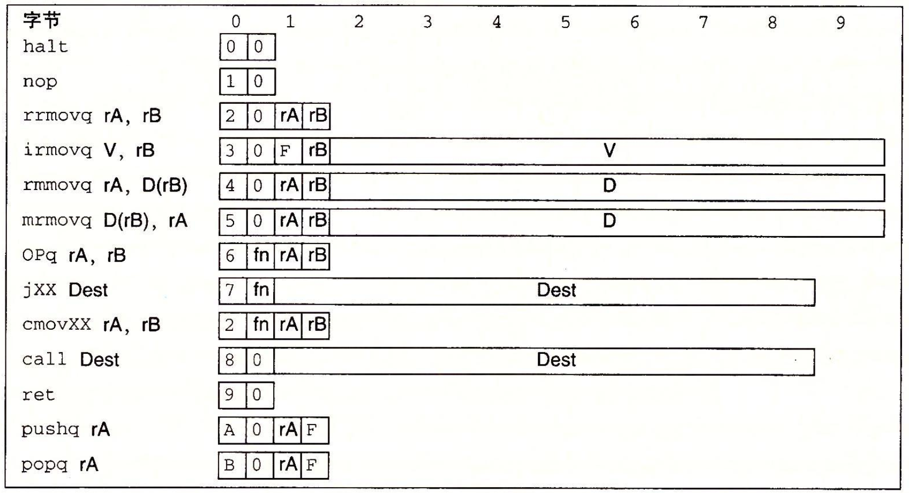
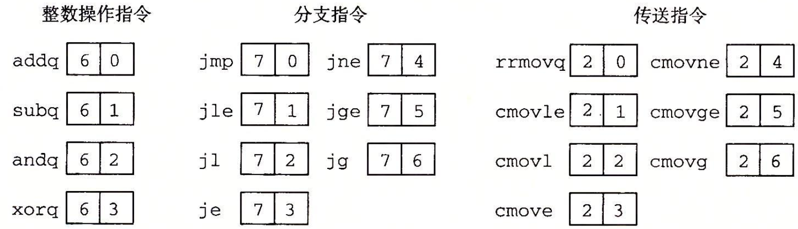

1.  一个处理器支持的指令和指令的字节级编码成为它的指令集体系结构。不同的处理器“家族”，例如Intel IA32和x86-64，IBM/Rreescale Power和arm处理器家族，都有不同的ISA。 ISA在编译器在编写者和处理器设计人员提供了一个概念抽象层，编译器编写者只需要知道允许哪些指令，以及它们时如何编码的；而处理器设计者必须建造出执行这些指令的处理器。指令集的一个重要性质就是字节编码必须有唯一的解释。任意一个字节序列要么是一个唯一的指令序列的编码，要么就不是一个合法的字节序列。      
2.  这本书定义的一个简答的指令集。称为“Y86-64”指令集。        
    + 状态码stat，它表明程序执行的总体状态。它会指示是正常运行还是出现了某种异常      
    + 它只包含8字节整数操作，寻址方式较少，操作也较少。只有8字节数据，所以称其为“字”      
    + 指定了四个movq：irmovq, rrmovq, mrmoq, rmmovq。源可以是立即数（i），寄存器（r），或者内存（m）。不允许从一个内存地址直接传送到另一个内存地址。也不允许将立即数传送到内存      
    + 有4个整数操作指令。是addq, subq, andq, xorq。它们支队寄存器数据进行操作。而x86-64还允许对内存数据进行操作。这些指令会设置3个条件码ZF，SF和OF。       
    + 7个跳转指令：jmp, jle, jl, je, jne, jge, jg。分支条件和x86-64的一样。       
    + 有6个条件传送指令：cmovle, cmovl, cmove, cmovne, cmovge, cmovg。这些指令的格式与寄存器-寄存器传送指令rrmovq一样，但是只有当条件码满足所需要的约束时，才会更i性能目标寄存器的值。    
    + call指令将返回地址入栈，然后跳到目的地址。ret指令从这样的调用中返回。       
    + pushq和popq指令实现了入栈和出战，就像x86-64中一样     
    + halt指令停止指令的执行，x86-64中有一个与之相当的指令hlt。x86-64的应用程序不允许使用这条指令，因为他会导致整个系统暂定运行。对于Y86-64来说，执行halt指令会导致处理器停止，并将状态码设置HLT。      
    +      
    + 每套指令需要1-10个字节不等，这取决于需要哪些字段。每条指令的第一个字节表明指令的类型。这个字节分为两个部分，每部分4为：高4位时代码部分，低4位时功能部分。代码值位0~0xB。功能值只有在一组想改年至零公用一个代码时才有用。
    +        
    + 程序寄存器存在CPU中的一个寄存器文件中，这个寄存器文件就是一个小的，以寄存器ID作为地址的随机访问存储器。当需要指明不应访问任何寄存器时，就用ID值0xF来表示：      

      |数字|寄存器名字|
      |-|-|
      |0|%rax|
      |1|%rcx|
      |2|%rdx|
      |3|%rbx|
      |4|%rsp|
      |5|%rbp|
      |6|%rsi|
      |7|%rdi|
      |8|%r8|
      |9|%r9|
      |A|%r10|
      |B|%r11|
      |C|%r12|
      |D|%r13|
      |E|%r14|
      |F|无寄存器|

      有的指令只有一个字节长，有的需要操作数的指令编码就更长一些。可能有附加的寄存器指示符字节，指定一个或者两个寄存器。成为rA,rB。从指令的汇编代码表示中可以看到，根据指令类型，指令可以指定用于数据源和目的的寄存器，或者时用于地址计算的基址寄存器没有寄存器操作数的指令，就没有寄存器指示符字节，那些只需要一个寄存器操作数的指令将另一个寄存器指示符设为0xF。有些指令需要一个附加的4字节长数字。这个字能作为irmovq的立即数数据，rmmovq和mrmovq的地址指示符的偏移量，以及分支指令和调用指令的目的地址。分支指令和调用指令的目的是一个绝对地址。而不像IA32中那样使用PC相对寻址方式。不过处理器使用PC相对寻址方式，分支指令的编码会更加简介，同时这样也能允许代码从内存的一部分复制到另一部分而不需要更新所有的分支目标地址。
    + 采用小端法编码。        
3.  CISC和RISC      

    |CISC|早期RISC|
    |-|-|
    |指令数量很多|指令数量少的多|
    |有些指令的延迟很长，包括将一个整块从内存的一部分复制到另一部分的指令，以及其他一些将多个寄存器的值复制到内存或者从内存复制到多个寄存器的指令|没有较长延迟的指令。有些造地的RISC机器甚至没有整数乘法 指令，要求编译器通过一系列假发来实现乘法|
    |编码是可变长度的x86-64的指令长度可以是1-15个字节|编码是固定长度的。通常所有的指令都编码位4个字节|
    |指定操作数的方式很多杨，在x86-64中，内存操作数指示符可以有许多不同的组合，这些组合由偏移量，基址和变址寄存器以及伸缩因子组成|金丹寻址方式，通常只有机制和偏移量寻址|
    |可以对内存和寄存器操作数进行算术和逻辑运算|只能对进粗气操作数进行算术和逻辑运算。允许使用内存引用的只有load和store指令，load是从内存读到寄存器，store是从寄存器写道内存。这种方法被称为load/store体系结构|
    |对机器级程序来说实现细节是不可见的。ISA提供了程序和如何执行程序之间的清晰的抽象|对机器级程序来说实现细节是可见的。有些RISC机器禁止某些特殊的指令序列，而有些跳转到吓一跳指令执行完了才会生效。编译器必须在这些约束条件下进行性能优化|
    |有条件吗，作为指令执行的副产品。设置了一些特殊的标志位，可以用于条件分支检测|没有条件码。相反对条件检测来说，要用明确的测试指令，这些指令会将测试结果放在一个普通的寄存器中|
    |栈密集的过程链接。栈被用来存取过程参数和返回地址|寄存器密集的过程链接。寄存器被用来存取过程参数和返回地址。因此有些过程能完全避免内存引用。通常处理器有更多的寄存器|

    Y86-64指令集既有CISC指令集的属性，也有RISC指令集的属性，和CISC一样，它有条件码，长度可变的指令，并用栈来保存返回地址。和RISC一样的是，它采用load/store体系结构和规则编码，通过寄存器来传递过程参数。       
4.  对Y86-64来说，程序员可见的状态包括状态码stat，它描述程序执行的总体状态。代码值1，命名为AOK，表示程序执行正常，而其他一些代码则表示发生了某种类型的一场。代码2，命名为HLT，表示处理器执行了一条halt指令。代码3，命名为ADR，表示处理器试图从一个非法内存地址读或者像一个非法内存地址写，可能是当取指令的时候，也可能是当读或者写数据的时候。代码4，命名为INS，表示遇到了非法的指令代码。对于Y86-64，当遇到这些一场的时候，我们就简单的让处理器停止执行指令。在更完整的设计中，处理器通常会调用一个异常处理程序，这个过程被指定用来处理遇到的某种类型的一场。一场处理程序可以被配置为不同的结果：      

    |值|名字|含义|
    |-|-|-|
    |1|AOK|正常操作|
    |2|HLT|遇到执行halt指令|
    |3|ADR|遇到非法地址|
    |4|INS|遇到非法指令|

5.  伪指令 .pos 0告诉汇编器应该从地址0处开始产生代码。      
6.  硬件描述语言看书        
7.  Y86-64的一条指令可以分为以下阶段：      
    + 取指(fetch)。取指阶段从内存读取指令字节，地址位PC的值。从指令中抽取出指令指示符字节的两个四位部分，成为icode（指令代码）和ifun（指令功能）。他可能取出一个寄存器指示符字节，指明一个或者两个寄存器操作数指示符rA和rB。他还可能取出一个四字节常数字valC，它按照顺序方式计算当前指令的下一条指令的地址valP。也就是说，valP等于PC的值加上已取出指令的长度        
    + 译码(decode)。译码阶段从寄存器文件中读入最多两个操作数，得到值valA和/或者valB。通常，它读入指令rA和rB字段指明的寄存器，不过有些指令是读寄存器%rsp的。     
    + 执行（execute）：在执行阶段，算术/逻辑单元要么执行指令指明的操作（根据ifun的值），计算内存引用的有效地址，要么增加或者减少栈指针。得到的值成为valE。在此阶段，也可能会设置条件码。对一条条件传送指令来说，这个阶段会检查条件码和传送条件（由ifun给出），如果条件成立，则更新目标寄存器。同样对一条跳转指令来说，买这个阶段会决定是不是应该选择分支。    
    + 方寸（memory）。方寸阶段可以将数据写入内存，或者从内存读出数据。读出的值位valM。      
    + 写回（write back）。协会阶段最多可以写两个结果到寄存器文件      
    + 更新PC（PC update）。将PC设置成吓一跳指令的地址       
    处理器无线循环，执行这些阶段。在Y86-64中的简化实现中，发生任何异常时，处理器就会停止。它执行halt指令或者非法指令，或者它试图读或者写非法地址。在更完整的设计中，处理器会进入一场处理模式，开始执行由一场的类型决定的特殊代码。     
    在设计硬件的时候，一个非常简单而一致的结构时非常重要的。降低复杂度的一种方法是让不同的指令共享尽量多的硬件。        
8.  Y86-64指令 OPQ/rrmoveq和irmovq在顺序实现中的计算。这些指令计算了一个值，并将结果存放在寄存器中。符号iconde:ifun表明指令字节的两个组成部分，而rA:rB表明寄存器指示符字节的两个组成部分。符号M1[x]表示访问内存位置x处的一个字节，而M8[x]表示访问8个字节:          
    |阶段|opq rA, rB|rrmovq rA, rB|irmovq V, rB|
    |-|-|-|-|
    |取值|icode:ifun &larr; M1[PC] rA:rB &larr; M1  valP &larr; PC + 2|icode:ifun &larr; M1[PC] rA:rB &larr; M1[PC+1] valP &larr; PC+2|icode:ifun &larr; M1[PC] rA:rB &larr; M1[PC+1] valC &larr; M8[PC+2] valP &larr; PC+10|
    |译码|valA &larr; R[rA] valB &larr; R[rB]|valA &larr; R[rA]||
    |执行|valE &larr; valB OP valA  Set CC|valE &larr; 0 + valA|valE &larr; 0+valC|
    |访存||||
    |写回|R[rB] &larr; valE|R[rB] &larr; valE|R[rB] &larr; valE|
    |更新PC|PC &larr; valP|PC &larr; valP|PC &larr; valP|

    整数操作指令的处理遵循上面的通用模式。        
    + 在取值阶段，不需要常数字，所以valP就计算位PC+2。      
    + 在译码阶段，需要读两个操作数      
    + 在执行阶段，他们和功能指示符 ifunc 一起在提供给ALU，这样就能计算出来valE。这个计算使用表达式valB OP valA来表达的。这里的OP表示ifunc指定的操作，要注意两个参数的顺序      
    + 访存阶段什么都不做      
    + 写回阶段，valE被写入寄存器rB        
    + 更新阶段，PC设置为valP        
    demo, subq:     

    |阶段|OPQ rA, rB|subq %rdx, %rbx|
    |-|-|-|
    |取值|icode:ifun &larr; M1[PC] rA:rB &larr; M1[PC+1] valP &larr; PC+2|icode:ifun &larr; M1[0x014]=6:1 rA:rB &larr; M1[0x015]=2:3 valP &larr; 0x014+2=0x016|
    |译码|valA &larr; R[rA] valB &larr; R[rB]|valA &larr; R[%rdx]=9 valB &larr; R[%rbx]=21|
    |执行|valE &larr; valB OP valA Set CC|valE &larr; 21-9=12 ZF &larr; 0, SF &larr; 0, OF &larr; 0|
    |访存|||
    |写回|R[rB] &larr valE|R[%rbx] &larr; valE=12|
    |更新|PC &larr; valP|PC &larr; valP=0x016|

9.  
